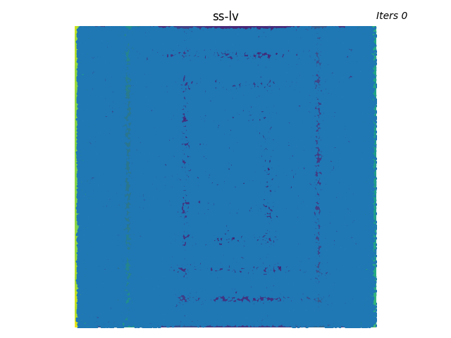

# Sinkhorn Step in JAX (ssax)

This `ssax` repository demonstrates the proof of concept for the Sinkhorn Step - a batch gradient-free optimizer for highly non-convex objectives in JAX. `ssax` is heavily inspired by the code structure of [OTT-JAX](https://github.com/ott-jax/ott) to utilize most of its linear solvers, enabling the users to easily switch between different solver flavors.

<p float="middle">
  
   
  
</p>

<p float="middle">
  
   
  
</p>

**NOTE**: This repository implements the Sinkhorn Step optimizer (in JAX) as a general-purpose standalone solver for non-convex optimization problems. The MPOT trajectory optimizer using Sinkhorn Step (in PyTorch) is released in this repository [mpot](https://github.com/anindex/mpot).

## Paper Preprint

This work has been accepted to NeurIPS 2023. Please find the pre-print here:

[](https://www.ias.informatik.tu-darmstadt.de/uploads/Team/AnThaiLe/mpot_preprint.pdf)

## Installation

Simply activate your conda/Python environment and run

```azure
pip install -e .
```

Please install [JAX with CUDA support](https://github.com/google/jax#installation) if you want to run the code on GPU for more performance.

## Run some demos

An example script is provided in `scripts/example.py`.

For testing Sinkhorn Step with various synthetic functions, run the following script with `hydra` settings:

```azure
python scripts/run.py experiment=ss-al
```

and find result animations in the `logs/` folder. You can replace the tag `experiment=<exp-filename>` with filenames found in `configs/experiment` folder. The current available optimization experiments are:

- `ss-al`: Ackley function in 2D
- `ss-al-10d`: Ackley function in 10D
- `ss-bk`: Bukin function in 2D
- `ss-dw`: DropWave function in 2D
- `ss-eh`: EggHolder function in 2D
- `ss-ht`: Hoelder Table function in 2D
- `ss-lv`: Levy function in 2D
- `ss-rb`: Rosenbrock function in 2D
- `ss-rg`: Rastrigin function in 2D
- `ss-st`: Styblinski-Tang function in 2D
- `ss-st-10d`: Styblinski-Tang function in 10D

**Note**: For tuning new settings, the most sensitive hyperparameters are `step_radius`, `probe_radius`, entropic regularization scalar `ent_epsilon` and the step-annealing scheme `epsilon_scheduler` parameters. You can play around with these parameters together with the other hyperparameters with synthetic functions to get a feeling of how they affect the optimization. For the 10D experiments, the plots are projected to the first 2 dimensions for visualization.

We also add some benchmarks on gradient approximation experiments based on cosine similarity between the Sinkhorn Step and the true gradient, over outer iterations and over entropic regularization on the Sinkhorn distance. We turn off step annealing for benchmarking purpose. The current available gradient approximation experiments are:

- `ss-al-cosin-sim`: Ackley function in 10D
- `ss-st-cosin-sim`: Styblinski-Tang function in 10D

To run them:
```azure
python scripts/benchmark_cosin_similarity_single.py experiment=ss-st-cosin-sim num_seeds=20
```

## Citation

If you found this work useful, please consider citing this reference:

```
@inproceedings{le2023accelerating,
  title={Accelerating Motion Planning via Optimal Transport},
  author={Le, An T. and Chalvatzaki, Georgia and Biess, Armin and Peters, Jan},
  booktitle={Advances in Neural Information Processing Systems (NeurIPS)},
  year={2023}
}
```

## See also

- The [OTT-JAX documentation](https://ott-jax.readthedocs.io/en/latest/) for more details on the linear solvers.
- [This wonderful library](http://www.sfu.ca/~ssurjano/optimization.html) of synthetic test functions from Sonja & Derek (SFU). 
